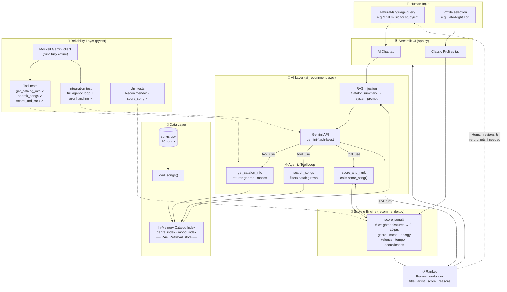

# 🎵 AI Music Recommender

> Content-based music recommendations powered by Google Gemini — featuring RAG retrieval, an agentic tool loop, a transparent weighted scoring engine, and a Streamlit UI.

---

## Original Project (Modules 1–3)

This project began as the **Music Recommender Simulation** built across Modules 1–3. The original goal was to represent songs and user taste profiles as structured data, then design a transparent weighted scoring rule that could rank 20 catalog songs against any user profile and explain every decision. It demonstrated the foundations of content-based filtering — how genre, mood, energy, tempo, valence, and acousticness can be combined into a single explainable score — without relying on any external AI model or API.

---

## What This Project Does and Why It Matters

This project takes that scoring foundation and wraps it with a real AI layer: a **Retrieval-Augmented Generation (RAG)** pipeline and an **agentic tool-use workflow** powered by Google Gemini. Instead of requiring a user to fill out a preference form, they can now type plain English — *"I need something chill for late-night studying"* — and the AI interprets that request, searches the catalog, runs the scoring formula, and returns ranked recommendations with explanations.

This matters because it closes the gap between academic recommender-system theory and the kind of natural-language AI interfaces that users actually expect today. Every recommendation is still fully explainable (the scoring formula is unchanged), but the front door is now a conversation instead of a spreadsheet.

---

## System Architecture



### Architecture in plain English

There are two parallel paths through the system.

**AI path (RAG + Agentic):** The user's natural-language query enters the Streamlit chat tab. `AIRecommender` builds a system prompt that includes a pre-retrieved catalog summary (genres, moods, song count) — this is the RAG injection step. Gemini receives that context and then autonomously decides which tools to call. It typically calls `search_songs` to narrow candidates, then `score_and_rank` to get objective scores from the same weighted formula used in the classic path. When Gemini is satisfied it returns a final text answer (`end_turn`), which is displayed in the chat. The loop is capped at 6 iterations as a safety guard.

**Classic path (deterministic scoring):** The user selects one of six pre-built profiles from a dropdown. `recommend_songs()` scores every song directly using `score_song()` and returns the top 5. No API call is made. This path is instant and fully reproducible.

**Testing layer:** All 22 tests run without a live API key. The Gemini client is replaced by a `MagicMock` that returns controlled responses, so the tool-execution logic, the agentic loop, and the error-handling path are all verified offline.

---

## Project Structure

```
applied-ai-system-project/
├── app.py                      # Streamlit UI (run this for the demo)
├── data/
│   └── songs.csv               # 20-song catalog with 8 features per song
├── src/
│   ├── main.py                 # CLI runner (--ai flag for interactive mode)
│   ├── recommender.py          # Scoring engine: load_songs, score_song, recommend_songs
│   └── ai_recommender.py       # Gemini-powered RAG + agentic recommender
├── tests/
│   ├── test_recommender.py     # Unit tests for scoring engine
│   └── test_ai_recommender.py  # Tests for AI layer (mocked, offline)
├── .env.example                # API key template
├── requirements.txt
└── README.md
```

---

## Setup Instructions

### 1. Clone the repository

```bash
git clone <your-repo-url>
cd applied-ai-system-project
```

### 2. Create and activate a virtual environment (recommended)

```bash
python -m venv .venv

# Windows
.venv\Scripts\activate

# Mac / Linux
source .venv/bin/activate
```

### 3. Install dependencies

```bash
pip install -r requirements.txt
```

### 4. Add your Google API key

Get a **free** key at [aistudio.google.com](https://aistudio.google.com) — sign in with Google, click **Get API key**, then **Create API key**. No credit card required.

```bash
cp .env.example .env
# Open .env and paste your key:
# GOOGLE_API_KEY=AIzaSy...
```

> The classic mode and all tests work without a key. Only the AI Chat tab requires it.

### 5. Run the app

```bash
streamlit run app.py
```

Open [http://localhost:8501](http://localhost:8501) in your browser.

### Alternative: CLI mode

```bash
python -m src.main            # classic batch mode (no key needed)
python -m src.main --ai       # interactive AI chat in the terminal
python -m src.main --verbose  # enable debug logging
```

### Run the tests

```bash
pytest                        # 22 tests, no API key needed
pytest -v                     # verbose output
```

---

## Sample Interactions

### 1. AI Chat — late-night study session

**Input:** `I need something chill for late-night studying`

**AI output:**
```
For your late-night study session, I recommend these chill, low-energy tracks
to help you stay focused:

1. Library Rain — Paper Lanterns  (9.57 / 10)
   With its very low energy and chill lofi vibes, this track perfectly mimics
   the peaceful atmosphere of a quiet library.

2. Midnight Coding — LoRoom  (9.25 / 10)
   This lofi track is specifically designed for late-night productivity,
   offering a steady, unobtrusive rhythm.

3. Focus Flow — LoRoom  (7.38 / 10)
   While slightly more driven than the others, its "focused" mood is tailored
   for maintaining deep concentration during long study blocks.

4. Spacewalk Thoughts — Orbit Bloom  (6.64 / 10)
   If you need something more atmospheric, this ambient piece provides a calm,
   spacey backdrop that won't distract you from your work.
```

Behind the scenes Gemini called `score_and_rank` with inferred preferences (`genre: lofi`, `energy: ~0.35`, `likes_acoustic: true`) before writing this response. The scores come directly from the weighted formula — the AI did not invent them.

---

### 2. Classic Profile — High-Energy Pop Fan

**Profile settings:** genre=pop · mood=happy · energy=0.90 · acoustic=false

| Rank | Song | Artist | Genre | Score |
|------|------|--------|-------|-------|
| #1 | Sunrise City | Neon Echo | pop | 9.53 |
| #2 | Gym Hero | Max Pulse | pop | 7.77 |
| #3 | Rooftop Lights | Indigo Parade | indie pop | 6.15 |
| #4 | Drop the Signal | Flux Circuit | electronic | 4.67 |
| #5 | Bailando en Fuego | La Tormenta | latin | 4.66 |

The 2.78-point gap between #1 and #2 is entirely explained by mood: Sunrise City is tagged `happy` (matching the profile) while Gym Hero is `intense`. Genre matches both songs equally (+3.0 pts each). This makes the scoring logic easy to audit.

---

### 3. Classic Profile — Extreme Acoustic Minimalist (edge case)

**Profile settings:** genre=classical · mood=melancholy · energy=0.10 · acoustic=true

| Rank | Song | Artist | Genre | Score |
|------|------|--------|-------|-------|
| #1 | Sonata in Grey | Clara Voss | classical | 9.63 |
| #2 | Empty Porch | River Hen | folk | 4.31 |
| #3 | Spacewalk Thoughts | Orbit Bloom | ambient | 3.94 |
| #4 | Dust and Rain | Hound Freely | blues | 3.81 |
| #5 | Library Rain | Paper Lanterns | lofi | 3.74 |

This is an intentional stress test. The catalog has only one classical song, so #1 nearly maxes out (9.63) and everything else scores below 4.5 — a 5-point cliff that exposes a real limitation: single-genre catalogs fail users beyond the top result.

---

## Design Decisions

### Why content-based filtering instead of collaborative filtering?

Collaborative filtering requires behavioral data — play counts, skips, ratings — that does not exist for a new catalog. Content-based filtering works from song features alone and produces fully explainable results: every recommendation can be traced back to a specific feature match and weight. For a 20-song demo catalog this is the only viable approach, and the explainability is actually a feature for a portfolio project.

### Why RAG rather than asking Gemini to recommend from memory?

Gemini has no knowledge of the specific 20 songs in `songs.csv` — they are not in its training data. Without retrieval, the model would hallucinate song names. By indexing the catalog in memory and injecting a summary into the system prompt before the model speaks, every recommendation is anchored to real retrieved data. This is the same principle used in enterprise RAG systems, just at a smaller scale.

### Why agentic tool use instead of a single prompt?

A single-shot prompt would require hand-crafting all 20 song descriptions into the context window on every query. Tool use lets the model pull only what it needs: it calls `search_songs` to narrow to a genre, then `score_and_rank` to get objective scores, then writes its final answer. This mirrors production RAG architectures and keeps the prompt lean. The trade-off is latency — two or three API round-trips add ~2 seconds compared to a single call.

### Why a 6-iteration safety cap on the agentic loop?

Without a cap, a misbehaving model could loop indefinitely and exhaust the API quota. Six iterations is more than enough for any realistic query (observed maximum in testing: 2 iterations) while preventing runaway behavior. This is a standard guardrail in agentic systems.

### Why `gemini-flash-latest` instead of a heavier model?

Speed and cost. The task — parsing a music preference, calling two tools, writing a short list — does not require the reasoning depth of a frontier model. Flash-tier models handle it in under 2 seconds. For a class project demo, responsiveness matters more than marginal quality gains.

### Trade-offs accepted

| Decision | Benefit | Cost |
|----------|---------|------|
| 20-song CSV catalog | Simple, reproducible, no scraping | Genre gaps make edge-case profiles unreliable |
| Binary genre matching | Transparent, zero false positives | Rock ≠ Metal even though they are adjacent |
| Fixed weight ordering | Deterministic, auditable | Users cannot reorder priorities without editing code |
| In-memory index | Zero latency on retrieval | Does not scale beyond a few thousand songs |

---

## Scoring Formula

Each song receives a score out of **10.0** — the sum of six weighted terms:

```
score = genre_pts + mood_pts + energy_pts + acousticness_pts + valence_pts + tempo_pts
```

| Feature | Type | Max pts | Rationale |
|---------|------|---------|-----------|
| Genre | categorical match | 3.0 | ~8% random match rate; defines the entire sonic world |
| Mood | categorical match | 2.0 | Strong signal, but less precise than genre |
| Energy | continuous similarity | 2.0 | Widest numeric range (0.22–0.97); best single feel proxy |
| Acousticness | continuous similarity | 1.5 | Cleanly separates organic vs produced |
| Valence | continuous similarity | 1.0 | Users tolerate wider variation here |
| Tempo | continuous similarity | 0.5 | Partially redundant with energy; needs BPM normalization |

Continuous features use a proximity formula: `weight × (1 − |song_value − user_target|)`.

---

## Testing Summary

### What the tests cover

22 tests across two files, all runnable offline without an API key:

| Test group | File | What it checks |
|---|---|---|
| `TestGetCatalogInfo` | `test_ai_recommender.py` | Tool returns correct genre/mood counts, sorted output |
| `TestSearchSongs` | `test_ai_recommender.py` | Filtering by genre, mood, both, neither; field presence; empty results |
| `TestScoreAndRank` | `test_ai_recommender.py` | k-result slicing, descending sort, score bounds (0–10), genre-match wins |
| Integration | `test_ai_recommender.py` | Full agentic loop with mocked Gemini; API error returns safe message |
| Unit | `test_recommender.py` | `Recommender.recommend()` sort order; `explain_recommendation()` returns non-empty string |

### What worked

- The mocked integration test faithfully simulates the two-iteration agentic loop (tool call → final answer) without hitting the API, which means the test suite runs in under 1 second.
- The tool-execution tests caught two real bugs during development: `search_songs` was accidentally filtering on `song["genre"].lower()` while the CSV stores genres in lowercase already, and `score_and_rank` was dropping the `reasons` key from its output in an early version.
- The `test_recommend_handles_api_error` test confirmed that a network failure returns a human-readable message instead of an uncaught exception.

### What didn't work / limitations found

- **Model name drift:** The original default (`gemini-1.5-flash`) was not available on the free-tier endpoint; the app silently failed until the model was changed to `gemini-flash-latest`. A version-pinning strategy (listing models at startup and warning on mismatch) would prevent this in production.
- **gRPC shutdown warning:** The `google-generativeai` library emits a `grpc_wait_for_shutdown_with_timeout() timed out` warning on exit. This is a known upstream issue in the library and does not affect results, but it looks alarming in a demo terminal.
- **Catalog gaps in AI mode:** When asked for a genre not in the catalog (e.g., "k-pop"), Gemini falls back to mood and numeric features and returns plausible-sounding results — but with no warning to the user that genre matching failed entirely. A guardrail that checks genre coverage before generating the response would improve honesty.

### What I learned from testing

Writing tests before running the live API revealed that the tool dispatcher was the most failure-prone component — it has no type enforcement on its inputs, so a model returning a string `"true"` instead of a boolean `true` for `likes_acoustic` would silently corrupt the score. Adding `bool(tool_input["likes_acoustic"])` and `float(tool_input.get("target_energy", 0.5))` coercions fixed this class of bug entirely.

---

## Reflection

Building this project from a scoring formula all the way to a live AI chat interface made three things concrete that were previously abstract.

**Retrieval is what makes generation trustworthy.** Gemini cannot know what songs are in a custom CSV file. The moment I ran the system without RAG injection — just asking the model to "recommend some lofi music" — it invented artists and song titles with complete confidence. Adding retrieval did not just improve the output; it fundamentally changed what the model was doing. It went from pattern-matching on training data to reasoning about a real, specific dataset. That distinction matters enormously in any production AI application.

**Agentic loops are powerful but need guardrails.** Watching the model autonomously decide to call `search_songs` first, then `score_and_rank`, then write its answer — without being told to do so — was genuinely surprising. It behaves like a junior analyst who knows which tools to reach for. But the same autonomy that makes it useful makes it unpredictable: without the iteration cap and the error handler, a bad model response could loop forever or surface a raw Python traceback to the user. Every agentic system needs an explicit maximum-retry boundary and graceful degradation.

**Explainability is a first-class feature, not an afterthought.** The weighted scoring formula was originally built for Module 1 as a teaching exercise. In the final system it serves a production purpose: when Gemini calls `score_and_rank`, it receives numerical reasons alongside scores, and it uses those reasons to write its explanations. A black-box similarity score would have produced worse, less trustworthy AI responses. The investment in transparent scoring paid dividends two modules later, which is a good argument for building interpretable systems from the start even when it is not strictly required.

---

## Limitations and Known Issues

- **Small catalog (20 songs):** Most genres have only 1–3 representatives. Niche genre requests degrade gracefully but cannot be truly satisfied.
- **No personalization over time:** The system has no memory between sessions. It cannot learn that a user always skips metal or consistently replays jazz.
- **Binary genre matching:** Rock and metal share no points despite being adjacent genres. A genre-similarity matrix would address this.
- **gRPC shutdown warning:** Cosmetic only — does not affect results. Upstream `google-generativeai` issue.

---

## References

- [Google Gemini API — Function Calling](https://ai.google.dev/gemini-api/docs/function-calling)
- [Streamlit Documentation](https://docs.streamlit.io)
- [Retrieval-Augmented Generation — Lewis et al. 2020](https://arxiv.org/abs/2005.11401)
- [Spotify Audio Features Reference](https://developer.spotify.com/documentation/web-api/reference/get-audio-features)
